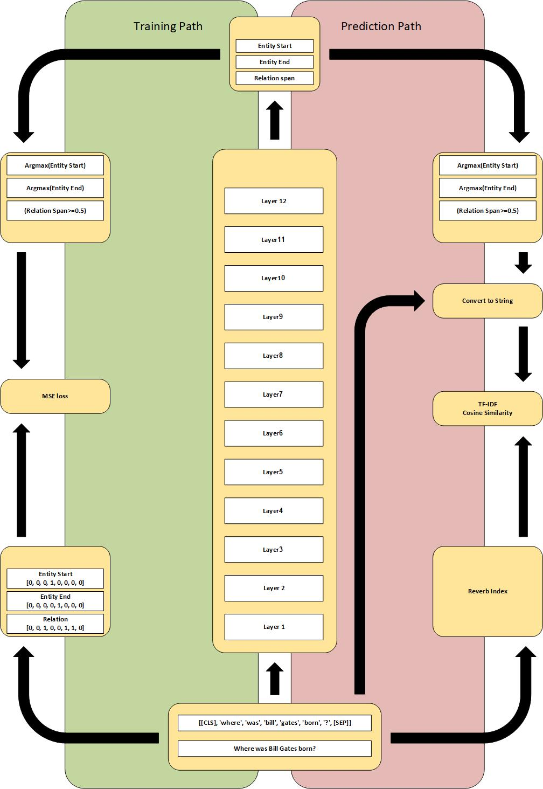

# BERT-QA
The `BERT QUESTION ANSWER` is `PYTHON SOURCE CODE` that allows `Researchers in the field of natural language processing`  to do `TRAINING/EVALUATION a QA system` on `reverb_wikipedia_tuples-1.1` Knowledge graph.
# Prerequisites
1. `LINUX/WINDOWS`
2. python=3.7
2. torch==1.8.1+cu101
3. networkx==2.5

The labeled training data remains private until the acceptance of the related Article, till then Validation purpose data can be explored by coordination with: `somayyeh.behmanesh@gmail.com` 

# Usage
```bash
git clone https://github.com/meti-94/BERT-QA.git
python node_edge_bert.py
```
The script would be able to find CERTIFIED data in its corresponding directory. Create the proper form data using:
```bash
python data.py
```
# Contributing
`mehdi_j94@outlook.com`
# License
`# to do`
# System Overview

